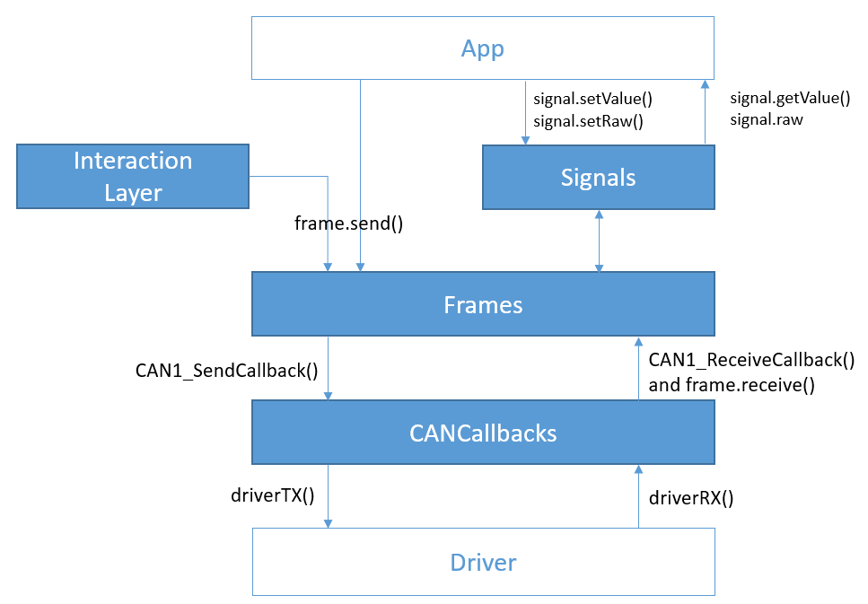
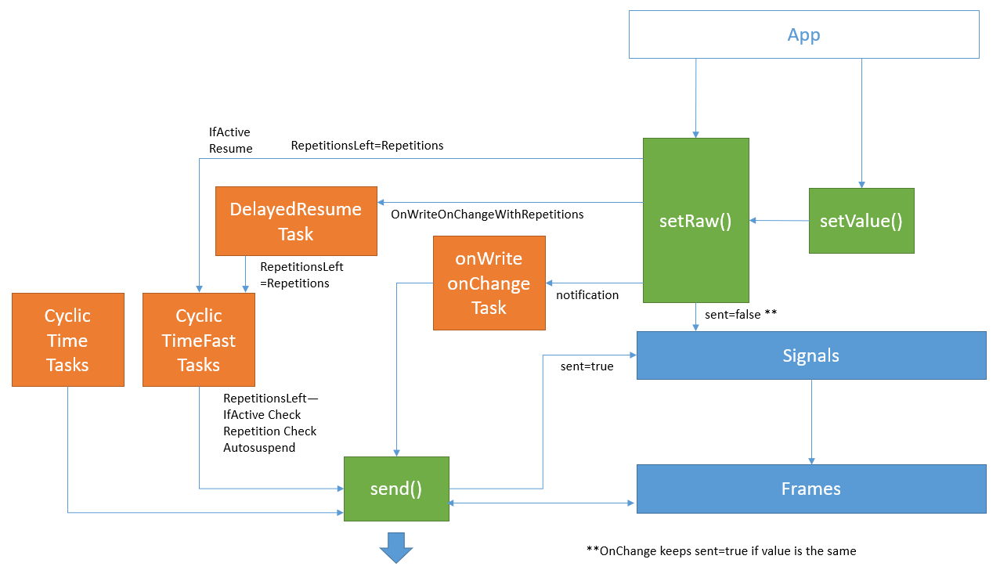
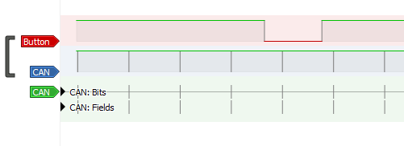
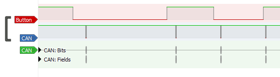
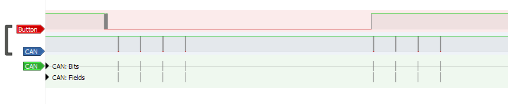
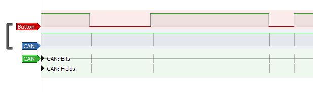
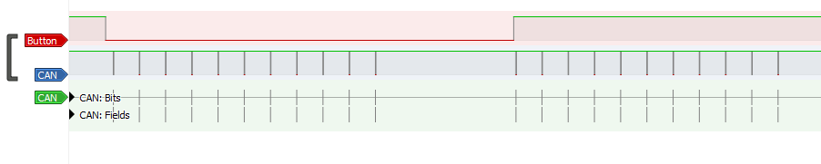
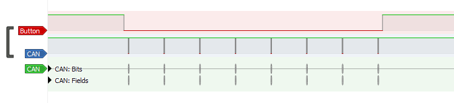
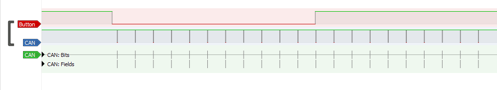

# Cantata
*Warning!* This is a work in progress, and it doesn't have proper testing done to it. Use at your own risk!

This Python module extracts information from CANdb Databases and generates C code for integrating it into embedded projects. It is environment agnostic, it can be integrated into any MCU in theory. Example files to integrate it into STM32 using HAL from ST are included in this repo.\
The candb library used for reading the dbc files ([cantools](https://cantools.readthedocs.io/en/latest/)) also accepts other formats, but it hasn't been tested.
## Install
You can install the package from PyPi
```bash
pip install python-cantata
```
Alternatively it can be installed from the git repository. Cloning the project and installing the pipenv for development

```bash
git clone https://github.com/polfeliu/cantata
cd cantata
pip install pipenv #if you don't have pipenv...
pipenv install
pipenv shell
```

## Usage
To generate the files you can either edit the last part of main.py (that right now generates the test) or create a new python file and import the module from it.
When creating the can object you will choose the prefix that all the objects will have. All the prefixes in this readme are "CAN1".
```python
from cantata import cantata
can = cantata("CAN1") # create the object setting the prefix that will be used in all objects.
#Handy if you have several networks

can.load('./test/CAN1.dbc')# Import database

src = r'./test/STM32TestProject/Core/Src/' #Where Source files should be copied to
hdr = r'./test/STM32TestProject/Core/Inc/' #Where Header files should be copied to

can.correctMinsMax() # Correct the minimums and maximums
can.process(node="Engine") #Generate for the Node Engine
can.process() # you can also generate all messages and signals without specifying the node

can.genFiles(src=src, hdr=hdr);
can.reset() #you can reset the data to be able to generate a new Node in another place
```

The function _process_ will extract the signals and frames of the database. The _node_ parameter passed indicates which node is the code for, meaning only the frames and signals necessary will be in the code. Also if the frame is TX it will only have send() method, and if it is RX it will be receive(). Signals will always have getValue() methods and only setValue() methods if they are TX. \
Even though RX messages may have signals that are not RX declared in the database but are actually received they won't have an object to access them, forcing you to keep the database consistent if you want to access the signals ;). \
If no node is passed to the process function (``` can.process()```) the function will calculate all the frames signals and methods. 

### Settings
The generation library has a set of settings that are documented across this readme. They can be edited directly on the main.py or access them or after creating the instance

``` python
can.settings["CallbackLib"] = "STM32CANCallbacks" #name of the library that implementes the Callback functions for this bus
```

### Mins and Max
I've found that many databases tend to have the mins and maxs of signals not calculated, because in the CANdb++ editor you have to click a button to update them according to the factors, offsets and datatype. \
To prevent mysterious errors when executing the program I programmed a cool optional feature: When you process a signal it checks that the mins and max are correct. If a signal fails the program halts and prints an error.\
The function correctMinsMax() can be called before processing the node and it simply recalculates all the mins and maxs to the cache.
To store the new mins and maxs you can call the function ``can.save("file")``.

### Filters
The library calculates a single hardware filter (filter and mask) for the RX messages of the node. This can be used to reduce the software load. The filters are declared in the header file

```c
// PassRatio: 67%  // Messages that this ECU Reads
// MatchedRatio: 67%  // Messages that the Filters lets pass
// Efficiency: 100%  // Effiency of the filter (passRation/matchedRatio)

#define CAN1_StandardFilter   0b01100000000
#define CAN1_StandardMask     0b10010011000
#define CAN1_ExtendedFilter   0b00000000000000000000000000000
#define CAN1_ExtendedMask     0b11111111111111111111111111111
```
More on CAN controller hardware filters: http://www.cse.dmu.ac.uk/~eg/tele/CanbusIDandMask.html

In the STM32CANCallbacks.c files there is an initialization of the CAN that includes the configuration of the bxCAN filter.

## Structure
The library generates cantata.c and cantata.h files with structures and functions for the following objects.



### Signals
The signal structure contains basic information of the signal provided by the database (length, byte_order, unit, initial_value, factor, offset, min, max) and own elements of the library:
* **value_type**: indicates in what type the raw signal will be stored
* **raw**: stores the raw signal, can be used to get the raw value
* **getValue**: pointer to function that returns the physical value according to the factor and offset
* **setValue**: pointer to function that sets the raw value (with the physical value passed as an argument) according to the factor and offset
* **setRaw**: pointer to function that sets the raw value
* **(optional) sent**: Boolean that indicates if the signal value has been sent by the Interaction Layer.
* **(optional) inactiveValue**: Indicates the signal inactive value if the interaction layer is activated and the sent type is IfActive 
```c
struct CAN1sig_SleepInd_t CAN1sig_SleepInd = {
    .length = 1,
    .byte_order = little_endian,
    .value_type = Tbool,
    .unit = "",
    .initial_value = 0,
    .factor = 1,
    .offset = 0,
    .min = 0,
    .max = 1,
    .raw = 0,
    .getValue = CAN1sig_SleepInd_getValue,
    .setValue = CAN1sig_SleepInd_setValue,
    .setRaw = CAN1sig_SleepInd_setRaw,
    .sent = true
};
```

#### getValue
```c
sleep = CAN1sig_SleepInd.getValue();
```
#### setValue
```c
sat = CAN1sig_SleepInd.setValue(34);
```
setValue checks if the value passed exceeds the signal maximum and minimum and saturates it accordingly. It also returns a boolean that informs if the value saturated.


#### setRaw
```c
CAN1sig_SleepInd.setRaw(34);
```

#### Value Tables
Signals can have Value tables associated to represent states, errors or others. These are automatically defined as enumerated types that are easily accessed 
```c
typedef enum {
    CAN1sig_StatusVT_Error=3,
    CAN1sig_StatusVT_GoSleep=2,
    CAN1sig_StatusVT_Running=1,
    CAN1sig_StatusVT_WakeUp=0,
}CAN1sig_StatusVT_t;
```
They can be used with setValue and getValue methods
```c
CAN1sig_Status.setValue(CAN1sig_StatusVT_WakeUp);
```


### Frames
Frames have similar structs with data from the database (ID, is_extended, DLC) and:
* **raw**: holds the raw message
* **receive**: unpacks the raw message and store the values of the signals to the signals raw parameter. Signals with big endian encoding are reversed on this process.
* **send**:  packs all the signals to the frame raw parameter and calls CAN1_SendCallback() with the frame calculated (more on that later)
* **signals**: structures of the signals with start position inside the signal, a mask for the assembly of the frames and a pointer to the signal struct. Signals that are multiplexed by other signals have a pointer to the multiplexor signal and a list of the multiplexed values they are valid for.
The pointer can be used to access the signals of a message like that:
```c
CAN1_NM_Engine.signals.CAN1sig_SleepInd.signal->setValue(34);
```

If InteractionLayer is activated and the message contains a signal with repetitions, the constant parameter _repetitions_ is defined. Parameter _repetitionsleft_ indicates how many repetitions more will be sent. 
```c
// Comment: None
struct CAN1_MultiplexExample2_t CAN1_MultiplexExample2 = {
    .ID = 0x301, //dec: 769
    .is_extended = false,
    .DLC = 8,
    .raw = 0,
    .send = CAN1_MultiplexExample2_send,
    .repetitions = 5,
    .repetitionsleft = 0,
    .signals = {
        .CAN1sig_ExSignal7 = {
            .signal = &CAN1sig_ExSignal7,
            .startbit = 0,
            .mask = 0b11111111
        },
        
        .CAN1sig_ExSignal8 = {
            .multiplexor = &CAN1sig_ExSignal7,
            .multiplexValues = {0},
            .signal = &CAN1sig_ExSignal8,
            .startbit = 8,
            .mask = 0b11111111
        },
        
        .CAN1sig_ExSignal9 = {
            .multiplexor = &CAN1sig_ExSignal8,
            .multiplexValues = {0},
            .signal = &CAN1sig_ExSignal9,
            .startbit = 16,
            .mask = 0b11111111
        },
        
    }
};
```
send and receive methods can be used like that:
```c
CAN1_NM_Engine.send()

CAN1_NM_Engine.raw = data; #You must first update the raw value of the message with what you are receiving 
CAN1_NM_Engine.receive();
```
Receive method is typically used from the ReceiveCallback

Send Method can be used from the application to decide when to send each frame. Optionally you can use the Interaction Layer that sends them without the application's intervention.

### CallBacks
#### Receive
The library also defines a receive callback (*CAN1_ReceiveCallback*) that can be used to handle incoming messages and store them in the respective structures according to the ID.
When the driver receives a message it should call this function with the appropiate parameters. This function is driver agnostic and it is generated in the cantata file.
```c
void CAN1_ReceiveCallback(uint64_t data, uint32_t ID, bool is_extended, uint8_t DLC){
    if((ID > 0x1FFFFFFF) & is_extended){
        //invalid extended identifier
    }else if((ID > 0x7FF) & !is_extended){
        //invalid standard identifier
    }

    else if((ID==CAN1_NM_Engine.ID) & (is_extended==CAN1_NM_Engine.is_extended)){
        CAN1_NM_Engine.raw = data;
        CAN1_NM_Engine.receive();
    }

    else if((ID==CAN1_NM_Gateway_PowerTrain.ID) & (is_extended==CAN1_NM_Gateway_PowerTrain.is_extended)){
        CAN1_NM_Gateway_PowerTrain.raw = data;
        CAN1_NM_Gateway_PowerTrain.receive();
    }
```

In the STM32CANCallbacks files there is an example on how to do this for STM32 using HAL.
#### Transmit
You should define a Transmit (*CAN1_SendCallback*) callback so that the messages are sent after being assembled. \
This function will be called with the *data, id, is_extended, DLC* parameters by each send() command.\
An example of this is also included in the STM32CANCallbacks files.

## Interaction Layer
Optionally, the Library can also generate FreeRTOS tasks for sending the messages and signals.

The Interaction Layer can be started and stopped by calling the functions:
```c
CAN1_InteractionLayerStart()
CAN1_InteractionLayerStop()
```

The test project with STM32 in this repository has examples of how the interaction layer works with a button.

Cyclic messages must be defined as so on the message attribute (GenMsgSendType) and signals of messages can have another GenSigSendType to have additional behaviour. Note that each message may contain several signals with different parameters and thus message may be sent more times than what is expected from one signals perspective.

The architecture that is generated for a database can be represented with the following diagram:


### Cyclic
Messages with attribute _GenMsgSendType = Cyclic_ are grouped by cyclic times and sent with the period set at _GenMsgCycleTime_ attribute



Message is sent no matter the state of the button
### On Change
Signals with attribute _GenSigSendType = OnChange_ send the messages they are assigned to whenever the raw value of the signal changes with .setValue() or .setRaw().
Note that .setValue() computes factor and offset, and rounds off to integers. If the calculated raw value of the signal doesn't change the signal is not sent 



Example: The state of the button is set to the signal constantly (at 50ms) and if the value changes the message is sent
```
CAN1sig_IdleRunning.setValue(button);
```

### On Change With Repetitions
Signals with attribute _GenSigSendType = OnChangeWithRepetition_ send the messages similary as _OnChange_ but, after the value is changed (and sent) the signal is sent N times at a fast rate, thus the message is sent N+1 times.
This fast rate is defined in the message attribute _GenMsgCycleTimeFast_ and number of times the message is sent is set with _GenMsgNrOfRepetition_.    


Example: Same as before

### On Write
Signals with attribute _GenSigSendType = OnWrite_ send the messages whenever the function .setValue() or .setRaw() are called, no matter if the value is set is the same.


Example: Every time the button changes state the application writes the same value to the signal
```c
if(button != button_last){
    CAN1sig_EngSpeed.setValue(1);
}
```

### On Write With Repetitions
Signals with attribute _GenSigSendType = OnWriteWithRepetition_ send the messages similarly as _OnWrite_ and after the message is sent the fast time for the repetitions is activated as described on **On Change With Repetitions**
 


Example: Same as before

### If Active
Signals with attribute _GenSigSendType = IfActive_ send the message whenever the signal has a value different than the set in the _GenSigInactiveValue_ attribute


Example: If the button is not pressed the signal is put in inactive value and thus is not sent. If not, an active value (1) is set to the signal.  
```c
if(button){
    CAN1sig_ExSignal9.setValue(CAN1sig_ExSignal9.inactiveValue);
}else{
    CAN1sig_ExSignal9.setValue(1);
}
```

### If Active With Repetitions
Signals with attribute _GenSigSendType = IfActiveWithRepetitions_ send the messages similarly as _IfActive_. Whenever the signal takes the value of _GenSigInactiveValue_ the signal is sent N times more as **On Change With Repetitions**


Example: Same as before